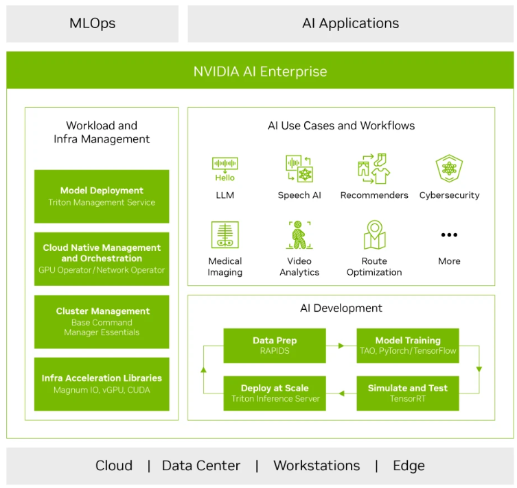

# Infra for AI  

## Cuda

The NVIDIA® CUDA® Toolkit provides a development environment for creating high performance GPU-accelerated applications. With the CUDA Toolkit, you can develop, optimize, and deploy your applications on GPU-accelerated embedded systems, desktop workstations, enterprise data centers, cloud-based platforms and HPC supercomputers. The toolkit includes GPU-accelerated libraries, debugging and optimization tools, a C/C++ compiler, and a runtime library to deploy your application.

[Cuda Downloads and Doc](https://developer.nvidia.com/cuda-toolkit-archive)

Using built-in capabilities for distributing computations across multi-GPU configurations, scientists and researchers can develop applications that scale from single GPU workstations to cloud installations with thousands of GPUs.

[NVIDIA® Virtual GPU (vGPU) Software Documentation](https://docs.nvidia.com/grid/index.html)

## Nvidia AI Enterprise 

[Nvidia AI Enterprise Arch](https://docs.nvidia.com/ai-enterprise/overview/0.1.0/platform-overview.html#nvidia-ai-software-supported)

## nvidia DGX Cloud （AI Trainning as a service）

[nvidia DGX Cloud Datasheet](https://resources.nvidia.com/en-us-dgx-cloud/nvidia-dgx-cloud-datasheet-us-web)

