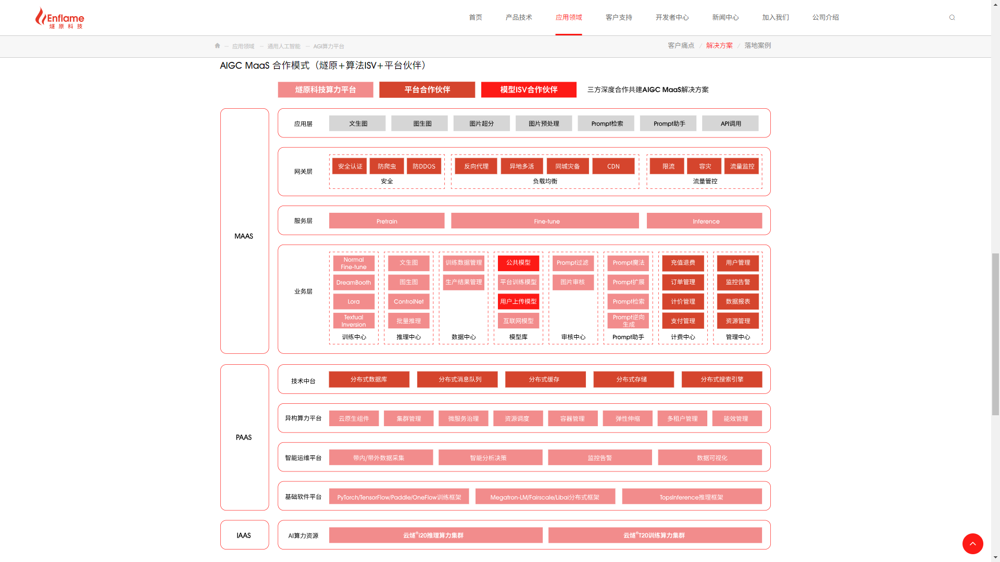

# 燧原科技

燧原创始人、董事长兼CEO赵立东表示：“随着生成式大模型的快速演进，以高性能AI芯片为基础的人工智能算力已成为数字经济发展的关键。面对一个高度竞争和生态高度依赖的市场，燧原科技始终坚持原始创新和开放开源的技术路线，与行业龙头企业深度合作，不断提升产品竞争力，打造坚实的算力底座。同时，我们积极参与AI芯片标准和生态建设，构筑核心竞争力，实现自我造血，走出一条自主可控的长期发展之路。”

“AIGC大模型的爆发改变了AI生态，行业的发展趋势开始向基于大模型的垂直行业赛道聚合。面对通用人工智能时代日益复杂的应用场景需求，燧原将以前瞻性的视野驱动技术演进，致力于为AIGC大模型提供完整的算力系统解决方案，成为通用人工智能时代的算力引擎。” 燧原创始人兼COO张亚林表示，“D轮融资将带来AIGC产业资源，我们将与领军企业一起，以创新的产品和技术、灵活多样的合作模式，通过深度的产业融合，构建完整的生态圈，全面拥抱通用人工智能时代的机遇，迎接明年大模型应用部署的元年。”

国方创新管理合伙人王磊表示：“生成式人工智能将会带来新一轮生产力的跨越式提升，未来发展空间巨大。AI算力芯片作为人工智能产业的硬件底座，处于产业链的核心环节，因此，从整个产业链发展来看，做中国自主可控的AI算力芯片是必然选择和关键方向。国方看好燧原科技在这一赛道的绝对领先优势，团队凭借卓越的研发实力和工程化能力持续迭代了三代商业化产品。我们认为，只有满足商业客户理性选择的科技企业才更具生命力，在进行产品更新的同时，燧原也能坚持满足企业的商业化场景需求，为客户提供更具性价比的解决方案，得到了市场的高度认可。在本轮领投之后，我们相信燧原将会迎来新一轮高速发展，助力中国AI算力芯片领域的崛起。”

腾讯投资董事总经理姚磊文表示：“燧原是国内领先的AI算力芯片厂商，团队研发实力强，执行力优秀，已量产了多代云端算力芯片，在互联网、教育科研、智慧城市等多个领域成功落地。此外，伴随多年来的持续投资和业务合作，腾讯与燧原合作的紫霄系列芯片已在OCR文字识别、智能会议、图像语音降噪等方面实现了业界同类产品两倍以上性价比，借由紫霄芯片，腾讯得以向金融、交通等行业客户提供普惠且高质量的人工智能解决方案。”

美图公司董事长兼CEO吴欣鸿表示：“AIGC正在成为推动美图发展的根本动力和变革源泉，高性价比、高可用、高适配的算力也正在成为美图公司发展的必备要素。燧原科技拥有不断推进的AI算力产品路线图，高性价比的系统化方案和原始创新的软硬件平台，这与美图公司在AIGC基础和垂直大模型以及多元化应用的全栈能力高度互补。我们希望跟燧原的深度合作能够助力美图在AIGC更大规模的部署和更广泛的普惠，从而为我们的终端客户创造更大的‘美的价值’。”

https://www.enflame-tech.com/application/agi

## 云燧T20：智能训练加速卡

https://www.enflame-tech.com/cloudblazer-t2x/t20

云燧T20是基于邃思®2.0芯片打造的面向数据中心的第二代人工智能训练加速卡，具有模型覆盖面广、性能强、软件生态开放等特点，可支持多种人工智能训练场景。同时具备灵活的可扩展性，提供业界领先的人工智能算力集群方案。

燧原智能互联（GCU-LARE®）是专为训练加速集群研发的互联技术，具有组网简洁、扩展性好、成本优化等优点。GCU-LARE互联技术可提升单机多卡和多机多卡系统的可扩展性，灵活实现从单机多卡到多机多卡乃至高达千卡级别不同规模的高性价比互联方案，以满足不同客户对深度学习训练集群的需求。

燧原科技专注人工智能领域云端和边缘算力产品，致力为通用人工智能打造算力底座，提供原始创新、具备自主知识产权的AI加速卡、系统集群和软硬件解决方案。凭借其高算力、 高能效比的创新架构和高效易用的软件平台，产品可广泛应用于泛互联网、智算中心、智慧城市，智慧金融、科学计算、自动驾驶等多个行业和场景。

